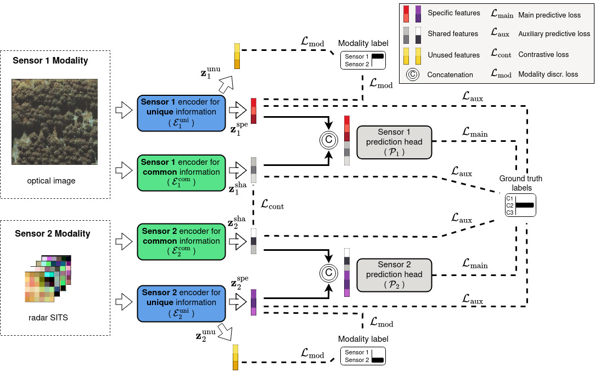
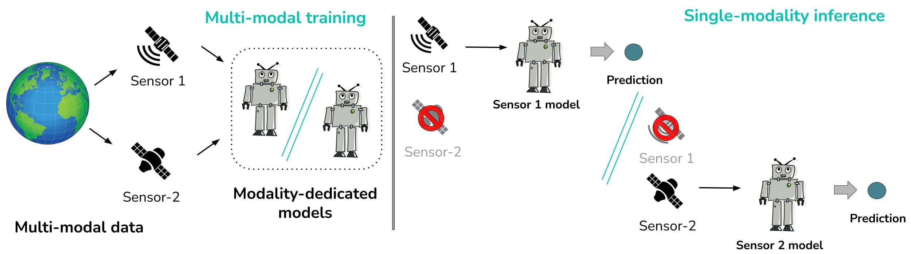

# MDiCo: Multi-modal Disentanglement for Co-learning with Earth Observation data
[](https://www.arxiv.org/abs/2510.19579) 
[](https://doi.org/https://doi.org/10.1007/s10994-025-06903-0)

> Public repository of our work [*Multi-modal co-learning for Earth observation: enhancing single-modality models via modality collaboration*](https://doi.org/10.1007/s10994-025-06903-0) 

---



The previous image illustrates our **MDiCo** framework in a multi-modal setting. We focus on the co-learning with multi-sensor Earth observation data, including classification (binary, multi-class, multi-label) and regression tasks. The objective is to achieve robust models for the all-but-one missing modality scenarios, i.e. multi-modal data available for training and a single-modality data available for inference.


## Training
We provide config file examples on how to train our model with different settings.

* To train a method based on MDiCo framework in the CropHarvest multi dataset, run:  
```
python train.py -s config/cropmulti_full.yaml
```
For other datasets you can check the other config files in the  [config folder](./config).

> [!NOTE]  
> Read about the used data in [data folder](./data)


## Evaluation


* To evaluate the predictive performance run:
```
python evaluate.py -s config/eval.yaml
```
All details to folder paths and configurations are inside the yaml files.

---


# 🖊️ Citation
Mena, Francisco, et al. "*Multi-modal co-learning for Earth observation: enhancing single-modality models via modality collaboration.*" Machine Learning 114.12 (2025): 279.

```bibtex
@article{mena2025multi,
  title={Multi-modal co-learning for Earth observation: enhancing single-modality models via modality collaboration},
  author={Mena, Francisco and Ienco, Dino and Dantas, Cassio F and Interdonato, Roberto and Dengel, Andreas},
  journal={Machine Learning},
  volume={114},
  number={12},
  pages={279},
  year={2025},
  publisher={Springer},
  doi={10.1007/s10994-025-06903-0}
}
```
